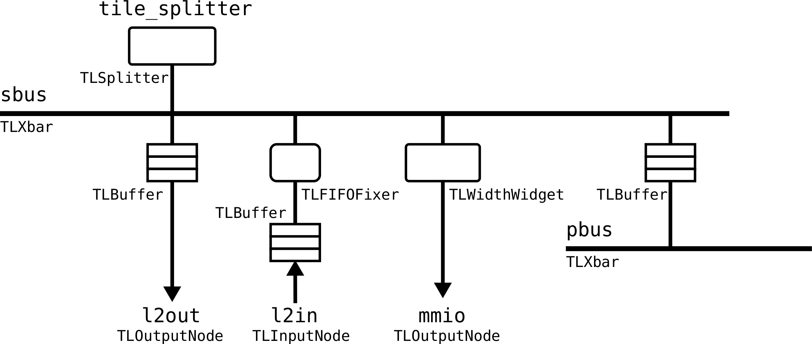

[Rocket](../Readme.md)/[coreplex](../coreplex.md)/[CoreplexNetwork](https://github.com/freechipsproject/rocket-chip/blob/master/src/main/scala/coreplex/CoreplexNetwork.scala)
========================
*On-chip interconnect of a Rocket-chip.*

**********************

### Coreplex Network
*Base of all on-chip interconnects.*

#### CoreplexNetwork
*Trait for LazyModule.*

~~~scala
trait CoreplexNetwork extends HasCoreplexParameters
~~~

+ **module** `CoreplexNetworkModule` pointer to the generated module.
+ **sbus** `LazyModule(new TLXbar)` globally-visible high-bandwidth devices.
+ **pbus** `LazyModule(new TLXbar)` globally-visible low-bandwidth devices.
+ **tile_splitter** `LazyModule(new TLSplitter)` cycle-free connection to external networks.
+ **int_xbar** `LazyModule(new IntXbar)` interrupt crossbar.
+ **mmio** `TLOutputNode()` external memory-mapped IO slaves.
+ **mmioInt** `IntInputNode()` external devices' interrupts.
+ **l2in** `TLInputNode()` external masters talking to the frontside of the shared cache.
+ **l2out** `TLOutputNode()` external slaves hanging off the backside of the shared cache.
+ **root** `Device` the root (`/`) desciption in the device tree.
+ **soc** `Device` the `soc` desciption in the device tree.
+ **cpus** `Device` the `cpus` desciption in the device tree.
+ **topManagers** `Some(ManagerUnification)` ??

#### CoreplexNetworkBundle
*Bundle trait for Rocket-chip with on-chip interconnects.*

~~~scala
trait CoreplexNetworkBundle extends HasCoreplexParameters
~~~

+ **outer** `CoreplexNetwork` pointer to the LazyModule.
+ **mmio** `HeterogeneousBag[TLBundle] = outer.mmio.bundleOut` mmio ports.
+ **interrupts** `HeterogeneousBag[TLBundle] = outer.mmioInt.bundleIn` external interrupts.
+ **l2in** `HeterogeneousBag[TLBundle] = outer.l2in.bundleIn` external master ports to the shared cache.
+ **l2out** `HeterogeneousBag[TLBundle] = outer.l2out.bundleOut` external slave ports from the shared cache.

#### CoreplexNetworkModule
*Module trait for Rocket-chip wirh on-chip interconnects.*

~~~scala
trait CoreplexNetworkModule extends HasCoreplexParameters
~~~

+ **outer** `CoreplexNetwork` pointer to the LazyModule.
+ **io** `CoreplexNetworkBundle` pointer to the I/O bundle.

Double check the device memory space match with device tree.

### Banked L2
*On-chip interconnect supporting L2 cache*

#### BankedL2CoherenceManagers
~~~scala
trait BankedL2CoherenceManagers extends CoreplexNetwork {
  val module: BankedL2CoherenceManagersModule
}
~~~

+ Derived from [CoreplexNetwork](CoreplexNetwork.md#coreplexnetwork)
+ **mem** `Seq[TLOutputNode]` output ports to the backing memory.

#### BankedL2CoherenceManagersBundle
~~~scala
trait BankedL2CoherenceManagersBundle extends CoreplexNetworkBundle {
  val outer: BankedL2CoherenceManagers
  val mem = HeterogeneousBag(outer.mem.map(_.bundleOut))
}
~~~

+ Derived from [CoreplexNetwork](CoreplexNetwork.md#coreplexnetworkbundle)

#### BankedL2CoherenceManagersModule
~~~scala
trait BankedL2CoherenceManagersModule extends CoreplexNetworkModule {
  val outer: BankedL2CoherenceManagers
  val io: BankedL2CoherenceManagersBundle
}
~~~

+ Derived from [CoreplexNetwork](CoreplexNetwork.md#coreplexnetworkmodule)

   
[CC-BY](https://creativecommons.org/licenses/by/3.0/), &copy; (2017) [Wei Song](mailto:wsong83@gmail.com), 25/06/2017

