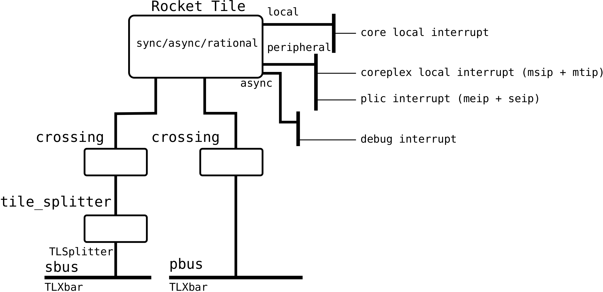

[Rocket](../Readme.md)/[coreplex](../coreplex.md)/[RocketTiles](https://github.com/freechipsproject/rocket-chip/blob/master/src/main/scala/coreplex/RocketTiles.scala)
========================

**********************

## Rocket Tiles
*Negotiate the interrupt, clock and reset connections for Rocket Tiles.*
*Allow for synchronous, asynchronous and rational connections.*

> Local Interrupts must be synchronized to the core clock
> before being passed into this module.
> This allows faster latency for interrupts which are already synchronized.
> The CLINT (coreplex local interrupts) and PLIC (platform level interrupt controller)
> outputs interrupts that are synchronous to the periphery clock,
> so may or may not need to be synchronized depending on the Tile's
> synchronization type.
> Debug interrupt is definitely asynchronous in all cases.

### trait HasRocketTiles
*Trait of the Rocket Tiles.*

~~~scala
trait HasRocketTiles extends HasSystemBus
    with HasPeripheryBus
    with HasPeripheryPLIC
    with HasPeripheryClint
    with HasPeripheryDebug {
  val module: HasRocketTilesModuleImp
}
~~~

+ **module** `HasRocketTilesModule` pointer to the generated module.
+ **tileParams** `Seq[RocketTileParams] = p(RocketCrossing)` parameters of individual tiles.
+ **localIntNodes** `Seq[Option[IntInputNode]` interrupt port for local interrupt sources.
+ **wiringTuple** `Seq[(Option[IntInputNode], RocketTileParams, Int)]` tuple of (intrrupt, tile, index).
+ **rocketWires** `Seq[HasRocketTilesBundle => Unit]` initialize Rocket tiles and produce connection callback functions.

### trait HasRocketTilesBundle
*Bundle trait of Rocket Tiles.*

~~~scala
trait HasRocketTilesBundle extends CoreplexRISCVPlatformBundle {
  val outer: HasRocketTiles
}
~~~

+ **outer** `HasRocketTiles` pointer to the LazyModule.
+ **local\_interrupts** `HeterogeneousBag(outer.localIntNodes.flatten.map(_.bundleIn))` Declare the interrupt lines.
+ **tcrs** `Vec[Bundle{Clock(INPUT), Bool(INPUT)}]` clock and reset ports.

### trait HasRocketTilesModule
*Module trait of Rocket Tiles.*

~~~scala
trait HasRocketTilesModule extends CoreplexRISCVPlatformModule {
  val outer: HasRocketTiles
  val io: HasRocketTilesBundle
}
~~~

+ **outer** `HasRocketTiles` pointer to the LazyModule.
+ **io** `HasRocketTilesBundle` pointer to the I/O bundle.

Call the connection callback functions defined by `outer.rocketWires`.

   

Last updated: 08/07/2017 
[CC BY-NC-SA 4.0](https://creativecommons.org/licenses/by-nc-sa/4.0/), &copy; (2017) [Wei Song](mailto:wsong83@gmail.com) 
[Apache 2.0](https://github.com/freechipsproject/rocket-chip/blob/master/LICENSE.SiFive), &copy; (2016-2017) SiFive, Inc 
[BSD](https://github.com/freechipsproject/rocket-chip/blob/master/LICENSE.Berkeley), &copy; (2012-2014, 2016) The Regents of the University of California (Regents)

