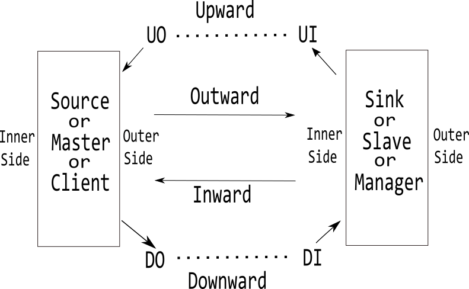

[Rocket](../Readme.md)/[diplomacy](../diplomacy.md)/[Node](https://github.com/freechipsproject/rocket-chip/blob/master/src/main/scala/diplomacy/Nodes.scala)
=====================
*A port binding elaboration library based on virtual nodes.*

**********************
+ [Node implementation](#node-implementation)
+ [Base node definitions](#base-node-definitions)
+ [Generic nodes](#generic-nodes)

**********************

> Explanation of general terms:
> - Inwards: the inner/source/client/master side of communication.  (eg. client => packet => [inner | outer] => packet => manager)
> - Outwards: the outer/sink/manager/slave side of communication.
> - Downwards: parameters configing the flow from inner to outer.
> - Upwards: parameters configing the flow outer to inner.
> - D/U: the node parameter for downwards/upwards flow.  (eg: client ==> D ==> manager, client <== U <== manager )
> - E: the generated packet helper from U and D.
> - B: the generated IO bundle from E.

 

Node implementation
-----------------------------------------

### trait InwardNodeImp
*Client side implementation of a node.*

~~~scala
trait InwardNodeImp[DI, UI, EI, BI <: Data]
~~~

+ **DI** (type) downwards flowing Parameters received on the client side of the node
+ **UI** (type) upwards flowing Parameters generated by the client side of the node
+ **EI** (type) packet parameters (generators) for the client side this node.
+ **BI** (type) bundle type for the client side of the node.
+ **edgeI** `(pd: DI, pu: UI) => EI` (virtual) generate the client side packet helper.
+ **bundleI** `(ei: EI) => BI` (virtual) generate the client side IO bundle.
+ **colour** `() => String` (virtual) get the color in node connection graph.
+ **connect** `(()=>Seq[EI], ()=>Seq[(BI, BI)], enM:Boolean) => (m:Option[LazyModule], cb:()=>Unit)` 
    Generate a port connection callback.
    - **enM** `Boolean` whether to insert a bus monitor.
    - **m** `Option[LazyModule]` the optional monitor node to be connected.
    - **cb** `()=>Unit` the generated callback function to actually connect IO bundles.
+ **mixI** `(pu: UI, InwardNode[DI, UI, BI]) => UI` insert node into parameters.
+ **getO** `(pu: UI) => Option[BaseNode]` most-outward common node.

### trait OutwardNodeImp
*Manager side implementation of a node.*

~~~scala
trait OutwardNodeImp[DO, UO, EO, BO <: Data]
~~~

+ **DO** (type) downwards flowing Parameters generated by the manager side of the node
+ **UO** (type) upwards flowing Parameters received on the manager side of the node
+ **EO** (type) packet parameters (generators) for the manager side this node.
+ **BO** (type) bundle type for the client manager of the node.
+ **edgeO** `(pd: DO, pu: UO) => EO` (virtual) generate the manager side packet helper.
+ **bundleO** `(eo: EO) => BO` (virtual) generate the manager side IO bundle.
+ **mixO** `(pd: DO, OutwardNode[DO, UO, BO]) => DO = pd`  insert node into parameters.
+ **getI** `(pd: DO) => Option[BaseNode] = None` most-inward common node.

### abstract class NodeImp
*A generic node implementation.*

~~~scala
abstract class NodeImp[D, U, EO, EI, B <: Data]
  extends Object with InwardNodeImp[D, U, EI, B] with OutwardNodeImp[D, U, EO, B]
~~~

Base node definitions
---------------------------

### abstract class BaseNode
*Base class of nodes.*

+ **lazyModule** `LazyModule` pointing to the lazyModule.
+ **index** `Int` an unique index for a node.
+ **externalIn** `Boolean` (virtual) whether to propagate parameters from inner to outer.
+ **externalOut** `Boolean` (virtual) whether to propagate parameters from outer to inner.
+ **nodename** `() => String` generate a node name from object name.
+ **name** `() => String` a full name prefixed with the module name.
+ **omitGraphML** `() => Bool` a portless node does not need a connection graph.
+ **gci** `() => Option[BaseNode]` (protected) get the greatest common client node type.
+ **gco** `() => Option[BaseNode]` (protected) get the greatest common manager node type.
+ **outputs** `() => Seq[(BaseNode, String)]` (protected) connected managers.
+ **inputs** `() => Seq[(BaseNode, String)]` (protected) connected clients.
+ **colour** `() => String` (protected) node color.
+ **reserve** `() => Boolean` (protected) reverse IO direction (eg: interrupt nodes).

### case class NodeHandle

~~~scala
case class NodeHandle[DI, UI, BI <: Data, DO, UO, BO <: Data]
    (inward: InwardNode[DI, UI, BI], outward: OutwardNode[DO, UO, BO])
    extends Object with InwardNodeHandle[DI, UI, BI] with OutwardNodeHandle[DO, UO, BO]
~~~

+ **inward** `InwardNode[DI, UI, BI]` (param).
+ **outward** `OutwardNode[DO, UO, BO]` (param).

### trait NodeBinding
*Always look from the input port's perspective.*

~~~scala
sealed trait NodeBinding
case object BIND_ONCE  extends NodeBinding
case object BIND_QUERY extends NodeBinding
case object BIND_STAR  extends NodeBinding
~~~

+ **BIND\_ONCE**
+ **BIND\_QUERY**
+ **BIND\_STAR**

### trait InwardNodeHandle
*Define the node binding handler on the client side.*

~~~scala
trait InwardNodeHandle[DI, UI, BI <: Data]
{
    val inward: InwardNode[DI, UI, BI]
}
~~~

+ **inward** `InwardNode[DI, UI, BI]` (virtual) pointing to the inward node.
+ **:=** `(h: OutwardNodeHandle[DI, UI, BI]) => Option[MonitorBase]`
+ **:\*=** `(h: OutwardNodeHandle[DI, UI, BI]) => Option[MonitorBase]`
+ **:=\*** `(h: OutwardNodeHandle[DI, UI, BI]) => Option[MonitorBase]`

### trait InwardNode
*Function definitions for a node who has the client side.*

~~~scala
trait InwardNode[DI, UI, BI <: Data] extends BaseNode with InwardNodeHandle[DI, UI, BI]
~~~

+ **inward** `InwardNode[DI, UI, BI] = this` pointer to the inward node.
+ **numPI** `Range.Inclusive` (protected, virtual) allowed range of ports on the client side.
+ **iPushed** `() => Int` (protected) number of inner nodes being processed.
+ **iPush** `(node:Int, node: OutwardNode[DI, UI, BI], binding: NodeBinding) => Unit` 
  (protected) Store a port connection.
+ **iBindings** `List[(Int, OutwardNode[DI, UI, BI], NodeBinding)]` 
  (protected, lazy) A list of ports to be connected (index, port, bind-type).
+ **iStar** `Int` (protected, virtual) number of star type bindings to be resolved.
+ **iPortMapping** `Seq[(Int, Int)]` (protected, virtual) ranges of each port.
+ **iParams** `Seq[UI]` (protected, virtual) parameters of each port.
+ **bundleIn** `Vec[BI]` (protected, virtual) a heterogeneous list of IO Bundles for the ports.

### trait OutwardNodeHandle

~~~scala
trait OutwardNodeHandle[DO, UO, BO <: Data]
{
  val outward: OutwardNode[DO, UO, BO]
}
~~~

+ **outward** `OutwardNode[DO, UO, BO]` (virtual) pointing to the outward node.

### trait OutwardNode
*Function definitions for a node who .*

~~~scala
trait OutwardNode[DO, UO, BO <: Data] extends BaseNode with OutwardNodeHandle[DO, UO, BO]
~~~

+ **outward** `OutwardNode[DO, UO, BO] = this` pointing to the outward node.
+ **numPO** `Range.Inclusive` (virtual) allowed range of ports on the manager side.
+ **oPushed** `() => Int` (protected) number of outer nodes being processed.
+ **oPush** `(index: Int, node: InwardNode [DO, UO, BO], binding: NodeBinding) => Unit` 
  (protected) Store a port connection.
+ **oBindings** `List[(Int, InwardNode [DO, UO, BO], NodeBinding)]` 
  (protected, lazy) A list of ports to be connected (index, port, bind-type).
+ **oStar** `Int` (protected, virtual) number of star type bindings to be resolved.
+ **oPortMapping** `Seq[(Int, Int)]` (protected, virtual) ranges of each port.
+ **oParams** `Seq[DO]` (protected, virtual) parameters of each port.
+ **bundleOut** `Vec[BO]` (protected, virtual) a heterogeneous list of IO Bundles for the ports.

Generic nodes
--------------------------------

### abstract class MixedNode

~~~scala
abstract class MixedNode[DI, UI, EI, BI <: Data, DO, UO, EO, BO <: Data](
    inner: InwardNodeImp [DI, UI, EI, BI],
    outer: OutwardNodeImp[DO, UO, EO, BO])(
    protected[diplomacy] val numPO: Range.Inclusive,
    protected[diplomacy] val numPI: Range.Inclusive)
    extends BaseNode with InwardNode[DI, UI, BI] with OutwardNode[DO, UO, BO]
~~~

+ **inner** `InwardNodeImp [DI, UI, EI, BI]` (param) input node parameters.
+ **outer** `OutwardNodeImp[DO, UO, EO, BO]` (param) output node parameters.
+ **numPO** `Range.Inclusive` (param) output range.
+ **numPI** `Range.Inclusive` (param) input range.
+ **resolveStar** `(iKown:Int, oKnown:Int, iStars:Int, oStars:Int) => (iStar:Int, oStar:Int)` 
  (protected, virtual) A function to resolve star type bindings.
+ **mapParamsD** `(Int, Seq[DI]) => Seq[DO]` 
  (protected, virtual) A function to propagate parameters from clients to managers.
+ **mapParamsU** `(Int, Seq[UO]) => Seq[UI]` 
  (protected, virtual) A function to propagate parameters from managers to clients.
+ **oPortMapping** `Seq[(Int, Int)]` (protected, lazy) ranges of ports connected to managers.
+ **iPortMapping** `Seq[(Int, Int)]` (protected, lazy) ranges of ports connected clients.
+ **oStar** `Int` (protected, lazy) number of managers binded with star type connections.
+ **iStar** `Int` (protected, lazy) number of clients binded with star type connections.
+ **oPorts** `Seq[(Int, InwardNode [DO, UO, BO])]` (lazy) a list of (index, port) binded by all its manager side ports.
+ **iPorts** `Seq[(Int, OutwardNode [DI, UI, BI])]` (lazy) a list of (index, port) binded by all its client side ports.
+ **oParams** `Seq[DO]` (protected, lazy) output port node parameters.
+ **iParams** `Seq[DI]` (protected, lazy) input port node parameters.
+ **edgesOut** `Seq[EO]` (lazy) output port edge parameters.
+ **edgesIn** `Seq[EI]` (lazy) input port edge parameters.
+ **externalEdgesOut** `Seq[EO]` (lazy) output edge parameter for external port connection.
+ **externalEdgesIn** `Seq[EI]` (lazy) input edge parameter for external port connection.
+ **flip** `Boolean = false` flip the port directions (needed for blind nodes: use inner for output in BlindOutput and use outer for input in BlindInput).
+ **wire** `Boolean = false` wire the ports if you want to grab access to from inside a module.
+ **bundleOut** `Seq[BO]` (lazy) get the output bundles.
+ **bundleIn** `Seq[BI]` (lazy) get the input bundles.
  > `bundleIn` and `bundleOut` are first utilized when generating the actual hardware module's IO.
  > Then these lazy value then triggers the series of port elaboration process.

+ **connectButDontMonitor** `(h: OutwardNodeHandle[DI, UI, BI]) => Option[MonitorBase]` 
  Equal to `:=` but without a monitor.
+ **:=** `(h: OutwardNodeHandle[DI, UI, BI]) => Option[MonitorBase]` 
  Bind one connection from `h` to this. Add a monitor.
~~~
(h)==>(x)
x.iPush(h, BIND_ONCE)
h.oPush(x, BIND_ONCE)
~~~
+ **:\*=** `(h: OutwardNodeHandle[DI, UI, BI]) => Option[MonitorBase]` 
  Bind N (N >= 0) connections from `h`to this, while this decides the value of N. Add a monitor.
~~~
(h)==>*(x,...)
x.iPush(h, BIND_STAR)
h.oPush(x, BIND_QUERY)
~~~
+ **:=\*** `(h: OutwardNodeHandle[DI, UI, BI]) => Option[MonitorBase]` 
  Bind N (N >= 0) connections from `h`to this, while `h` decides the value of N. Add a monitor.
~~~
(h,...)*==>(x)
x.iPush(h, BIND_QUERY)
h.oPush(x, BIND_STAR)
~~~

Reference: https://github.com/freechipsproject/rocket-chip/pull/536
>In some places we would like to pass multiple connections through an edge.
>
>For example, at the TL master port for the Coreplex, we want to accept multiple masters that are then connected to the l1tol2 crossbar. However, within the Coreplex we do not know how many such edges are needed.
>
>For some time, diplomacy has supported multiple connections via a single Node. However, there was no way to leverage this for a flexible number of connections. This patch changes that.
>
>foo :=* bar // indicates that foo should be connected to bar as many times as bar requires 
>bar := baz1 
>bar := baz2 // there will be two connections from bar to foo
>
>foo :*= bar // indicates that bar should be connected to foo as many times as foo requires 
>baz1 := foo 
>baz2 := foo // two times

Some remarks:
> The star type connections allow variable number of ports to be connected and resolved at elaboration time.
> However, there are two problems which may not be handled properly:
> 1. There cannot be a ring, othewise the lazy process cannot figure out a value.
> 2. On a side (inner or outer) of a node, there can be one star bind in maximal.

### class MixedAdapterNode
*Generic bus adapters.*
**_Allow only one side to have a star binding._**

~~~scala
class MixedAdapterNode[DI, UI, EI, BI <: Data, DO, UO, EO, BO <: Data](
  inner: InwardNodeImp [DI, UI, EI, BI],
  outer: OutwardNodeImp[DO, UO, EO, BO])(
  dFn: DI => DO,
  uFn: UO => UI,
  num: Range.Inclusive = 0 to 999)
  extends MixedNode(inner, outer)(num, num)
~~~
+ **inner** `InwardNodeImp [DI, UI, EI, BI]` (param) client side node implementation.
+ **outer** `OutwardNodeImp[DO, UO, EO, BO]` (param) manager side node implementation.
+ **dFn** `(DI) => DO` (param) downwards parameter resolvation funciton.
+ **uFn** `(DO) => DI` (param) upwards parameter resolvation function.
+ **num** `Range.Inclusive = 1 to 999` (param) the maximal number of connections for either clients or managers.
+ **resolveStar** `(iKown:Int, oKnown:Int, iStars:Int, oStars:Int) => (iStar:Int, oStar:Int)` (protected) resolve the `iStar` and `oStar` numbers. Onle one side can have a star!
+ **mapParamsD** `(Int, p:Seq[DI]) => Seq[DO]` (protected) resolve oParams using dFn(), resolve port individually.
+ **mapParamsU** `(Int, p:Seq[UO]) => Seq[UI]` (protected) resolve iParams using uFn(), resolve port individually.

### class MixedNexusNode
*Generic class of switches.*
**_No star binding is allowed for both sides._**

~~~scala
class MixedNexusNode[DI, UI, EI, BI <: Data, DO, UO, EO, BO <: Data](
  inner: InwardNodeImp [DI, UI, EI, BI],
  outer: OutwardNodeImp[DO, UO, EO, BO])(
  dFn: Seq[DI] => DO,
  uFn: Seq[UO] => UI,
  numPO: Range.Inclusive = 1 to 999,
  numPI: Range.Inclusive = 1 to 999)
  extends MixedNode(inner, outer)(numPO, numPI)
~~~

+ **inner** `InwardNodeImp [DI, UI, EI, BI]` (param) input node parameters.
+ **outer** `OutwardNodeImp[DO, UO, EO, BO]` (param) output node parameters.
+ **dFn** `(Seq[DI]) => DO` used to resolve oParams.
+ **uFn** `(Seq[UO]) => UI` used to resolve iParams.
+ **numPO** `Range.Inclusive = 1 to 999` (param) output range.
+ **numPI** `Range.Inclusive = 1 to 999` (param) input range.
+ **externalIn** `Boolean = true` generate external input port bundles.
+ **externalOut** `Boolean = true` generate external output port bundles.
+ **resolveStar** `(iKown:Int, oKnown:Int, iStars:Int, oStars:Int) => (0,0)` (protected) a NexusNode does not allow any star bindings.
+ **mapParamsD** `(Int, p:Seq[DI]) => Seq[DO]` (protected) resolve oParams using dFn().
+ **mapParamsU** `(Int, p:Seq[UO]) => Seq[UI]` (protected) resolve iParams using uFn().
+ **oStar** `Int = 0` (protected, const)
+ **iStar** `Int = 0` (protected, const)

### class AdapterNode
*Base node class for a bus adapter.*

~~~scala
class AdapterNode[D, U, EO, EI, B <: Data](imp: NodeImp[D, U, EO, EI, B])(
  dFn: D => D,
  uFn: U => U,
  num: Range.Inclusive = 0 to 999)
    extends MixedAdapterNode[D, U, EI, B, D, U, EO, B](imp, imp)(dFn, uFn, num)
~~~

### class NexusNode
*Base node for a switch node (crossbar, multiplexer ordemultiplexer).*

~~~scala
class NexusNode[D, U, EO, EI, B <: Data](imp: NodeImp[D, U, EO, EI, B])(
  dFn: Seq[D] => D,
  uFn: Seq[U] => U,
  numPO: Range.Inclusive = 1 to 999,
  numPI: Range.Inclusive = 1 to 999)
    extends MixedNexusNode[D, U, EI, B, D, U, EO, B](imp, imp)(dFn, uFn, numPO, numPI)
~~~

### case class SplitterArg

~~~scala
case class SplitterArg[T](newSize: Int, ports: Seq[T])
~~~

+ **newSize** `Int` (param) number of output channels (Upwards or downwards depending on T).
+ **ports** `T` (param) port parameter (D and U).

### class MixedSplitterNode
*Demultiplexer for complicate channel bundles.*
**_No star binding is allowed for both sides._**

oParams.size == N * iParams.size, where N is a positive integer.

~~~scala
class MixedSplitterNode[DI, UI, EI, BI <: Data, DO, UO, EO, BO <: Data](
  inner: InwardNodeImp [DI, UI, EI, BI],
  outer: OutwardNodeImp[DO, UO, EO, BO])(
  dFn: SplitterArg[DI] => Seq[DO],
  uFn: SplitterArg[UO] => Seq[UI],
  numPO: Range.Inclusive = 1 to 999,
  numPI: Range.Inclusive = 1 to 999)
  extends MixedNode(inner, outer)(numPO, numPI)
~~~

+ **inner** `InwardNodeImp [DI, UI, EI, BI]` (param) input node parameters.
+ **outer** `OutwardNodeImp[DO, UO, EO, BO]` (param) output node parameters.
+ **dFn** `(SplitterArg[DI]) => DO` used to resolve oParams.
+ **uFn** `(SplitterArg[UO]) => UI` used to resolve iParams.
+ **numPO** `Range.Inclusive = 1 to 999` (param) output range.
+ **numPI** `Range.Inclusive = 1 to 999` (param) input range.
+ **externalIn** `Boolean = true` generate external input port bundles.
+ **externalOut** `Boolean = true` generate external output port bundles.
+ **resolveStar** `(iKown:Int, oKnown:Int, iStars:Int, oStars:Int) => (iStar:Int, oStar:Int)` (protected) resolve `iStar` and `oStar`. `iStar <= 0, oStar <= iKown`.
+ **mapParamsD** `(ps:Int, p:Seq[DI]) => Seq[DO]` (protected) resolve oParams using number of ports (ps) and dFn().
+ **mapParamsU** `(ps:Int, p:Seq[UO]) => Seq[UI]` (protected) resolve iParams using number of ports (ps) and uFn().

### class SplitterNode

~~~scala
class SplitterNode[D, U, EO, EI, B <: Data](imp: NodeImp[D, U, EO, EI, B])(
  dFn: SplitterArg[D] => Seq[D],
  uFn: SplitterArg[U] => Seq[U],
  numPO: Range.Inclusive = 1 to 999,
  numPI: Range.Inclusive = 1 to 999)
    extends MixedSplitterNode[D, U, EI, B, D, U, EO, B](imp, imp)(dFn, uFn, numPO, numPI)
~~~

### class IdentityNode

~~~scala
class IdentityNode[D, U, EO, EI, B <: Data](imp: NodeImp[D, U, EO, EI, B])
  extends AdapterNode(imp)({s => s}, {s => s})
~~~

### class OutputNode
*A hierarchical output node.*
**_No star binding is allowed for both sides._**

~~~scala
class OutputNode[D, U, EO, EI, B <: Data](imp: NodeImp[D, U, EO, EI, B])
    extends IdentityNode(imp)
~~~

### class InputNode
*A hierarchical input node.*
**_No star binding is allowed for both sides._**

~~~scala
class InputNode[D, U, EO, EI, B <: Data](imp: NodeImp[D, U, EO, EI, B])
    extends IdentityNode(imp)
~~~

### class SourceNode
*A source node in a network.*
**_Allow one star at the manager side._**
**_The number of bindings is defined at design time._**

~~~scala
class SourceNode[D, U, EO, EI, B <: Data](imp: NodeImp[D, U, EO, EI, B])(po: Seq[D])
  extends MixedNode(imp, imp)(po.size to po.size, 0 to 0)
~~~

+ **imp** `NodeImp [D, U, EO, EI, B]` (param) node parameters.
+ **po** `Seq[D]` 
  (param) Downwards parameters of all manager side connections.
  The size of `po` decides the total number of port bindings. 
+ **externalIn** `Boolean = false` no external input port bundles.
+ **externalOut** `Boolean = true` generate external output port bundles.
+ **resolveStar** `(iKown:Int, oKnown:Int, iStars:Int, oStars:Int) => (0, po.size - oKnown)` (protected)
+ **mapParamsD** `(ps:Int, p:Seq[DI]) => Seq[DO] = po` (protected) assign downwards parameters.
+ **mapParamsU** `(ps:Int, p:Seq[UO]) => Seq()` (protected) no needed.

### class SinkNode
*A sink node in a network.*
**_Allow one star at the client side._**
**_The number of bindings is defined at design time._**

~~~scala
class SinkNode[D, U, EO, EI, B <: Data](imp: NodeImp[D, U, EO, EI, B])(pi: Seq[U])
  extends MixedNode(imp, imp)(0 to 0, pi.size to pi.size)
~~~

+ **imp** `NodeImp [D, U, EO, EI, B]` (param) node parameters.
+ **pi** `Seq[U]` .
  (param) Upwards parameters of all manager side connections.
  The size of `po` decides the total number of port bindings. 
+ **externalIn** `Boolean = true` generate external input port bundles.
+ **externalOut** `Boolean = false` no external output port bundles.
+ **resolveStar** `(iKown:Int, oKnown:Int, iStars:Int, oStars:Int) => (pi.size - iKnown, 0)` (protected)
+ **mapParamsD** `(ps:Int, p:Seq[DI]) => Seq()` (protected) no needed.
+ **mapParamsU** `(ps:Int, p:Seq[UO]) => Seq[UI] = pi` (protected) assign upwards parameters.

### BlindOutputNode

~~~scala
class BlindOutputNode[D, U, EO, EI, B <: Data](imp: NodeImp[D, U, EO, EI, B])(pi: Seq[U])
  extends SinkNode(imp)(pi)
{
  override val externalIn: Boolean = false
  override val flip = true
  override lazy val bundleOut = bundleIn
}
~~~

### BlindInputNode

~~~scala
class BlindInputNode[D, U, EO, EI, B <: Data](imp: NodeImp[D, U, EO, EI, B])(po: Seq[D])
  extends SourceNode(imp)(po)
{
  override val externalOut: Boolean = false
  override val flip = true
  override lazy val bundleIn = bundleOut
}
~~~

### InternalOutputNode

~~~scala
class InternalOutputNode[D, U, EO, EI, B <: Data](imp: NodeImp[D, U, EO, EI, B])(pi: Seq[U])
  extends SinkNode(imp)(pi)
{
  override val externalIn: Boolean = false
  override val externalOut: Boolean = false
  override val wire = true
  override lazy val bundleOut = bundleIn
}
~~~

### InternalInputNode

~~~scala
class InternalInputNode[D, U, EO, EI, B <: Data](imp: NodeImp[D, U, EO, EI, B])(po: Seq[D])
  extends SourceNode(imp)(po)
{
  override val externalIn: Boolean = false
  override val externalOut: Boolean = false
  override val wire = true
  override lazy val bundleIn = bundleOut
}
~~~

   

Last updated: 25/12/2017 
[CC BY-NC-SA 4.0](https://creativecommons.org/licenses/by-nc-sa/4.0/), &copy; (2017) [Wei Song](mailto:wsong83@gmail.com), [Leway Colin](mailto:colin4124@gmail.com) 
[Apache 2.0](https://github.com/freechipsproject/rocket-chip/blob/master/LICENSE.SiFive), &copy; (2016-2017) SiFive, Inc 
[BSD](https://github.com/freechipsproject/rocket-chip/blob/master/LICENSE.Berkeley), &copy; (2012-2014, 2016) The Regents of the University of California (Regents)

